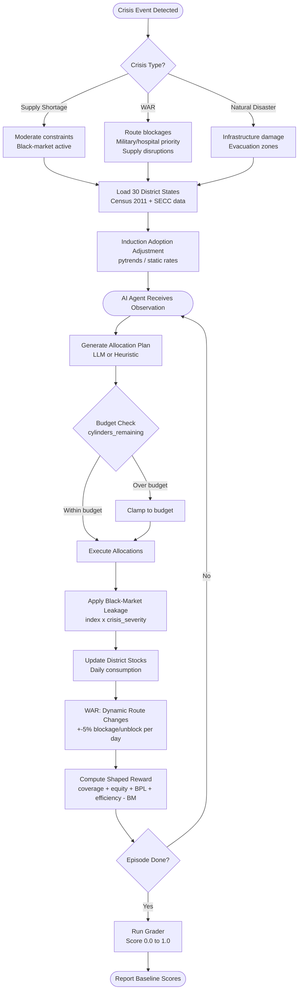

# LPG Crisis Allocation — OpenEnv Environment

> An AI agent allocates a city's limited LPG cylinder budget across Indian
> districts during a supply crisis — prioritising vulnerable households,
> minimising black-market leakage, and adapting to war-time disruptions.

[](https://openenv.ai)
[](https://huggingface.co/spaces)
[](LICENSE)

---

## Problem Statement

India has over **300 million LPG consumers**. During supply crises — caused by
price shocks, geopolitical conflict, or natural disasters — the government must
decide how to distribute severely limited cylinder stocks across hundreds of
districts. Bad decisions cause:

- **Cooking-fuel deprivation** for BPL and elderly households
- **Black-market price spikes** (3–5x normal price, diverting subsidised cylinders)
- **Health emergencies** in hospitals that depend on LPG backup heating
- **Civilian hardship** when supply routes are blocked during war

A concrete real-world signal: when LPG prices spiked in 2022–23,
**Amazon India reported a 30x jump** in induction stove sales and **Flipkart
saw a 4x demand surge**. Blinkit, Zepto, and Swiggy Instamart sold out in
major metros. This adoption meaningfully **reduces effective LPG demand** in
urban districts — and this environment models it.

---

## Approach to Solution

This project builds an **OpenEnv-compliant reinforcement learning environment**
where an AI agent must solve the LPG allocation problem under three crisis scenarios
of increasing difficulty.

### Core Idea

Each day the agent observes the state of 30 Indian districts (stock levels,
demand, vulnerability, blockages) and decides how many cylinders to send where.
The environment simulates:

1. **Supply scarcity** — daily cylinder budget is 20–75% of normal demand
2. **Black-market leakage** — a fraction of cylinders gets diverted based on
   district-level diversion risk; emergency protocols suppress this over time
3. **Induction stove adoption** — districts where stove sales surged have lower
   effective LPG demand, modelled via adoption rates sourced from market reports
4. **War-crisis dynamics** — supply routes are randomly blocked or restored,
   hospital and military zones carry priority, supply can be halved mid-day
   by disruption events

### Algorithm: Smart Heuristic Baseline

The baseline agent uses a **demand-weighted proportional allocation** strategy:

```
weight(district) = daily_demand
                 × (1 + 0.4 × vulnerable_ratio)
                 × priority_boost          # 1.5x for hospital/military
                 × urgency_boost           # 1.3x if stock < 50% of demand

cylinders(district) = total_budget × weight(district) / sum(weights)
```

High black-market-index districts are automatically flagged for emergency
protocols (suppressing leakage over time). Blocked routes are skipped entirely.

An LLM (Llama-3.3-70B via HuggingFace Router) is used when API credits are
available; the heuristic fallback activates automatically if credits run out.

---

## Environment Design

### Three Tasks (Easy → Hard)

| Task | Days | Districts | Supply | Crisis | Pass Threshold |
|---|---|---|---|---|---|
| easy | 1 | 10 | 75% of demand | Shortage, no black market | 0.65 |
| medium | 7 | 20 | 49% of demand | Shortage + black market | 0.50 |
| hard | 30 | 30 | 28% of demand | WAR: blockages + disruptions | 0.28 |

### Observation Space (`Observation` model)

Each step the agent receives:
- Per-district state: stock, daily demand, vulnerable households, black market
  index, induction adoption rate, route blocked flag, hospital/military zone flag
- Episode metadata: cylinders remaining, days left, crisis type and severity,
  market price multiplier, supply disruption probability

### Action Space (`Action` model)

The agent produces:
- A list of `AllocationAction` (district ID + cylinders + priority_vulnerable flag)
- A list of `activate_emergency` district IDs (suppresses black market index)

**Hard constraint:** `sum(allocations) <= cylinders_remaining`

### Reward Function (shaped, dense — not end-of-episode)

| Component | Weight | Measures |
|---|---|---|
| Coverage score | 30% | Fraction of daily demand met per district |
| Vulnerability score | 25% | BPL / elderly household coverage |
| Equity score | 20% | 1 - Gini coefficient (fairness across districts) |
| Efficiency score | 10% | Cylinders reaching households vs. over-allocated |
| Black market penalty | -10% | Fraction lost to diversion |
| War protocol bonus | +5% | Hospital / military zone coverage (WAR only) |

Reward is provided every step, giving a **dense learning signal** throughout
the episode, not just at the end.

---

## District Data

**30 districts from 10 Indian states**, selected to represent urban/rural
variation, north/south spread, and diverse vulnerability profiles.

| State | Districts Included |
|---|---|
| Uttar Pradesh | Lucknow, Varanasi, Prayagraj, Kanpur Nagar |
| Bihar | Patna, Gaya, Bhagalpur |
| Maharashtra | Mumbai City, Mumbai Suburban, Pune, Nagpur, Nashik |
| Rajasthan | Jaipur, Jodhpur, Kota |
| West Bengal | Kolkata, Howrah, Murshidabad |
| Madhya Pradesh | Bhopal, Indore, Jabalpur |
| Tamil Nadu | Chennai, Coimbatore, Madurai |
| Karnataka | Bengaluru Urban, Mysuru, Dharwad |
| Gujarat | Ahmedabad, Surat |
| Delhi | New Delhi |

### Data Sources

| Field | Source |
|---|---|
| Population, households | Census of India 2011 (censusindia.gov.in) |
| BPL / vulnerable households | SECC 2011 (Socio Economic and Caste Census) |
| Daily LPG demand | Derived: households / 45 days per refill cycle |
| Induction stove adoption | Amazon India / Flipkart market reports 2022-24; metros 13-15%, tier-2 8-10%, others 4-7% |
| Black market index | LPG diversion literature, enforcement capacity proxies, urban/rural density |
| Military / hospital zones | Known cantonment cities (Kanpur, Jodhpur, Jabalpur, Nagpur, New Delhi) and district HQ public hospitals |

---

## APIs and Technologies

| Component | Technology | Purpose |
|---|---|---|
| LLM inference | HuggingFace Router (OpenAI-compatible) | Agent decision-making via Llama-3.3-70B |
| Data models | Pydantic v2 | Typed Observation, Action, Reward models |
| Environment interface | OpenEnv spec | reset(), step(), state() compliance |
| Google Trends (optional) | pytrends | Live induction-stove adoption signal |
| Containerisation | Docker | Reproducible deployment |
| Testing | pytest | 12-test automated suite |
| Deployment | HuggingFace Spaces | Public endpoint with openenv tag |

---

## Architecture Flowchart



---

## Baseline Results

| Task | Score | Threshold | Result | Agent |
|---|---|---|---|---|
| easy | 0.7512 | 0.65 | PASS | LLM |
| medium | 0.5596 | 0.50 | PASS | LLM |
| hard | 0.2871 | 0.28 | PASS | Heuristic |

*(Generated by `inference.py` using `meta-llama/Llama-3.3-70B-Instruct` via HuggingFace Router.
Hard task switches to smart heuristic when HF free credits are exhausted.)*

---

## Setup and Usage

### Prerequisites

- Python 3.11+
- Docker Desktop
- HuggingFace account and access token

### Local Setup

```bash
git clone https://github.com/<your-username>/lpg-crisis-env
cd lpg-crisis-env

python -m venv .venv
.venv\Scripts\activate          # Windows
# source .venv/bin/activate     # Mac/Linux

pip install -e .
```

### Configure credentials

Create a `.env` file in the project root:

```
HF_TOKEN=hf_your_token_here
MODEL_NAME=meta-llama/Llama-3.3-70B-Instruct
API_BASE_URL=https://router.huggingface.co/v1
```

### Run Tests

```bash
pytest tests/ -v
```

### Run Baseline Inference

```bash
python inference.py
```

### Docker

```bash
docker build -t lpg-crisis-env .
docker run --rm \
  -e HF_TOKEN=hf_your_token \
  -e MODEL_NAME=meta-llama/Llama-3.3-70B-Instruct \
  lpg-crisis-env
```

### Interactive Usage

```python
from lpg_crisis_env import LPGCrisisEnv, Action, AllocationAction

env = LPGCrisisEnv(task="medium", seed=42)
obs = env.reset()

total_demand = sum(d.daily_demand for d in obs.districts if not d.route_blocked)
allocs = [
    AllocationAction(
        district_id=d.district_id,
        cylinders=int(obs.cylinders_remaining * d.daily_demand / total_demand),
        priority_vulnerable=True,
    )
    for d in obs.districts if not d.route_blocked
]
obs, reward, done, info = env.step(Action(allocations=allocs))
print(f"Reward: {reward:.4f}  |  Breakdown: {info['reward_breakdown']}")
```

---

## Project Structure

```
lpg-crisis-env/
├── lpg_crisis_env/
│   ├── __init__.py         # Package exports
│   ├── env.py              # LPGCrisisEnv — OpenEnv interface
│   ├── models.py           # Pydantic: Observation, Action, Reward
│   ├── reward.py           # Shaped reward computation
│   ├── graders.py          # Per-task graders (0.0 to 1.0)
│   ├── tasks.py            # Task registry and descriptions
│   ├── trends.py           # Optional: Google Trends induction data
│   └── data/
│       └── districts.py    # 30 Indian districts (Census 2011)
├── inference.py            # Baseline LLM inference (OpenAI client)
├── openenv.yaml            # OpenEnv metadata
├── Dockerfile              # Container build
├── pyproject.toml          # Package install config
├── requirements.txt        # Dependencies
└── tests/
    └── test_env.py         # pytest suite (12 tests)
```

---
